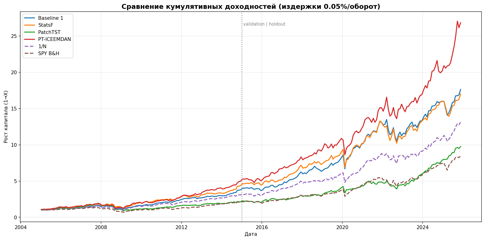

# PatchTST и ICEEMDAN для портфельной оптимизации Марковица

**Сравнение методов оценки ожидаемой доходности для портфельной оптимизации Марковица: историческое среднее, AutoARIMA, PatchTST и PatchTST поверх ICEEMDAN-декомпозиции**

*Comparison of Expected-Return Estimators for Markowitz Portfolio Optimization: Historical Mean, AutoARIMA, PatchTST, and PatchTST over ICEEMDAN Decomposition*

**Автор:** Кротов Ю.В. (Iurii Krotov)
**Дата:** Июнь 2026 (June 2026)

🇬🇧 **English version:** [README_EN.md](README_EN.md)

---

## Быстрый старт

```bash
# 1. Установка зависимостей
pip install -r requirements.txt

# 2. Запуск всех моделей (интерактивно)
python run_all.py
```

Результаты сохраняются в `results/`.

---

## Тема и цель

Эмпирическая проверка гипотезы: улучшает ли замена исторических средних на прогнозы трансформера PatchTST оценку ожидаемых доходностей μ в задаче портфельной оптимизации Марковица — и помогает ли предварительная сигнальная декомпозиция ряда (ICEEMDAN) раскрыть потенциал трансформера.

## Формальная постановка

Решается классическая задача Марковица — максимизация коэффициента Шарпа касательного портфеля:

```
max  (w'μ - r_f) / sqrt(w'Σw)
s.t. Σ w_i = 1,  min_w ≤ w_i ≤ max_w  (long-only)
```

где **w** — веса активов, **μ** — вектор ожидаемых доходностей (в проекте сравниваются способы его оценки), **Σ** — ковариационная матрица (Ledoit–Wolf, **одинаковая для всех методов**), **r_f** — безрисковая ставка. Сравниваемые стратегии отличаются **только способом оценки μ** — всё остальное (окна, ковариация, ограничения, оптимизатор) идентично, поэтому сравнение честное.

## Сравниваемые подходы

| Стратегия | Оценка μ | Описание |
|---|---|---|
| **Baseline 1** | mean(r) × 252 | Классический Марковиц (историческое среднее) |
| **Baseline 2** | AutoARIMA(21).mean × 252 | StatsForecast AutoARIMA |
| **PatchTST** | forecast(21).mean × 252 | Self-Supervised трансформер на сыром ряде |
| **PatchTST + ICEEMDAN** | forecast(21).mean × 252 | Тот же трансформер на компонентах декомпозиции |
| **Equal Weight (1/N)** | — | Наивный бенчмарк: равные веса |
| **Buy & Hold (SPY)** | — | Наивный бенчмарк: индекс S&P 500 |

**PatchTST + ICEEMDAN** — основной вклад работы. Train-окно каждого актива каузально (без заглядывания в будущее) раскладывается методом CEEMDAN/ICEEMDAN; переменное число IMF детерминированно группируется в 3 канала по среднему периоду — **шум** (< 5 дней), **цикл** (5–63 дня), **тренд** (> 63 дней + остаток). Каналы подаются как многоканальный вход в один PatchTST (channel-independence, общие веса), итоговый прогноз — сумма прогнозов каналов.

## Методология оценки

- **Walk-forward бэктест:** окно обучения 1260 дней (5 лет), тест 21 день (1 месяц), сдвиг 21 день. Модели переобучаются на каждом шаге.
- **Транзакционные издержки:** оборот считается против дрейфованных весов, по умолчанию 5 б.п. за единицу оборота. Метрики приводятся без издержек (gross) и с ними (net).
- **Разделение для честной оценки гиперпараметров:** *validation* (тестовые месяцы ≤ 2014-12-31) — настройка; *holdout* (2015–2026) — финальная оценка вне периода настройки; *full* — весь период.
- **Тест значимости:** разница коэффициентов Шарпа проверяется парным bootstrap (10 000 итераций).

## Данные

- **Активы:** 20 акций из 10 секторов S&P 500 (задаются в `config/config.yaml`).
- **Период данных:** 2000-01-01 — 2026-01-15; бэктест покрывает ~2005–2026 (251 ребалансировка).
- **Источник:** Yahoo Finance (Adjusted Close, учитывает дивиденды и сплиты).
- **Файлы:** `data/raw/prices.csv`, `data/raw/log_returns.csv`, `data/raw/benchmark_log_returns.csv` (SPY).

> ⚠️ Универсум из 20 ныне торгуемых компаний с полной историей с 2000 г. содержит **survivorship bias** — абсолютные доходности всех стратегий завышены. Это ограничение учитывается при интерпретации (см. [RESULTS.md](RESULTS.md)).

---

## Результаты (полный период, net, издержки 5 б.п.)

| Метрика | Baseline 1 | AutoARIMA | PatchTST | **PatchTST+ICEEMDAN** | 1/N | SPY |
|---|---|---|---|---|---|---|
| Sharpe Ratio | 0.72 | 0.68 | 0.52 | **0.87** | 0.66 | 0.48 |
| Calmar Ratio | 0.44 | 0.40 | 0.21 | **0.49** | 0.35 | 0.21 |
| Max Drawdown | −33.3% | −35.9% | −53.8% | −34.9% | −37.4% | −50.2% |
| Annual Return | 14.7% | 14.5% | 11.5% | **17.0%** | 13.1% | 10.8% |
| Оборот/мес | 18% | 50% | 113% | 112% | 4% | 0% |

**По периодам (Sharpe, net):**

| Период | Baseline 1 | AutoARIMA | PatchTST | **ICEEMDAN** | 1/N | SPY |
|---|---|---|---|---|---|---|
| validation 2005–2015 | 0.68 | 0.73 | 0.31 | **0.86** | 0.56 | 0.29 |
| **holdout 2015–2026** | 0.75 | 0.63 | 0.75 | **0.88** | 0.75 | 0.66 |
| full 2005–2026 | 0.72 | 0.68 | 0.52 | **0.87** | 0.66 | 0.48 |



### Ключевые выводы

1. **Декомпозиция «спасает» трансформер.** Та же сеть даёт Sharpe 0.52 на сыром ряде и **0.87** на ICEEMDAN-компонентах. Разница статистически значима (bootstrap, p = 0.005) — это главный результат работы.
2. **ICEEMDAN лучший по риск-скорректированной доходности на всех трёх периодах** (0.86 / 0.88 / 0.87) — преимущество устойчиво и вне периода настройки гиперпараметров.
3. **Честная граница результата.** По строгому тесту Ледуа–Вольфа (HAC + studentized bootstrap, поправка Холма) ICEEMDAN значимо превосходит наивные бенчмарки (1/N, SPY) и сырой трансформер, но над классическим Марковицем на историческом среднем превосходство лишь **маргинально значимо (10%, Холм-p ≈ 0.088)**, не достигая 5%. Это согласуется с литературой о том, что простые бейзлайны крайне трудно уверенно обыграть (DeMiguel et al., 2009).
4. **Точность прогноза ≠ качество портфеля.** У ICEEMDAN худшие RMSE и hit-rate, но лучший портфель: оптимизатору важна относительная структура μ между активами, а не точечная точность.
5. **Ограничение — оборот.** ICEEMDAN перестраивает портфель на ~112%/мес. Преимущество над бейзлайном сохраняется до ~20–25 б.п. издержек и исчезает при 30+ б.п.

Подробный разбор, тест значимости и анализ чувствительности к издержкам: **[RESULTS.md](RESULTS.md)**.

---

## Конфигурация

Все параметры — в `config/config.yaml`. Главные блоки:

- `data` — тикеры, период, тикер бенчмарка;
- `backtest` — окна обучения/теста, `data_end` (обрезка периода для тюнинга);
- `models.patchtst` — режим `fast`/`full`, `padding_patch`, `n_workers` (параллелизм по тикерам);
- `models.iceemdan` — параметры CEEMDAN (`trials`, `epsilon`, `seed`), группировка IMF, флаг денойзинга, кэш;
- `optimization` — безрисковая ставка, метод ковариации, ограничения весов;
- `evaluation` — транзакционные издержки, граница validation/holdout.

### Как изменить набор акций

1. Откройте `config/config.yaml`, отредактируйте список `data.tickers` (тикеры Yahoo Finance). При необходимости измените `start_date`/`end_date` и `benchmark_ticker`.
2. Перекачайте данные одним из способов:
   ```bash
   python src/data/downloader.py        # перезапишет data/raw/*.csv под новый список
   ```
   либо запустите `python run_all.py` и ответьте `y` на вопрос «Скачать данные заново?».
3. Старый кэш декомпозиций (`data/cache/iceemdan/`) можно не чистить — ключ кэша включает значения окна, поэтому новые данные пересчитаются автоматически.

> Ограничение: все тикеры должны иметь котировки на всём периоде — строки с пропусками удаляются целиком (выравнивание панели по общим торговым дням).

---

## Установка и запуск

```bash
python3 -m pip install -r requirements.txt
```

### Полный запуск (интерактивно)

```bash
python3 run_all.py
```

Скрипт спросит, скачивать ли данные, и какие модели запускать (`Enter` = все четыре + бенчмарки). Весь вывод дублируется в `results/run_log_<timestamp>.txt`.

### Фоновый запуск (долгие прогоны)

Полный прогон PatchTST/ICEEMDAN занимает часы. Чтобы процесс пережил закрытие терминала и сон системы (на macOS):

```bash
# macOS: caffeinate не даёт ноутбуку уснуть; держите крышку открытой
nohup caffeinate -is bash -c 'printf "n\n\n" | python3 run_all.py' > run.log 2>&1 &

# Прогресс в реальном времени
tail -f results/run_log_*.txt
```

`printf "n\n\n"` отвечает «не качать данные» и «запустить все модели» на интерактивные вопросы.

### Выбор отдельных стратегий

В ответ на вопрос о моделях введите номера через запятую: `1` — Baseline 1, `2` — AutoARIMA, `3` — PatchTST, `4` — PatchTST + ICEEMDAN. Бенчмарки 1/N и SPY считаются всегда.

### Отдельные бэктесты

```bash
python3 src/backtesting/backtest.py                  # Baseline 1
python3 src/backtesting/backtest_statsforecast.py    # AutoARIMA
python3 src/backtesting/backtest_patchtst.py         # PatchTST
python3 src/backtesting/backtest_patchtst_iceemdan.py # PatchTST + ICEEMDAN
```

### Запуск на GPU (Google Colab)

Для машин без локального GPU есть ноутбук [notebooks/colab_run.ipynb](notebooks/colab_run.ipynb): загрузите архив проекта на Google Drive, выберите GPU-runtime и выполняйте ячейки. Ноутбук содержит бенчмарк скорости и предрасчёт декомпозиций. Примечание: на маленькой модели проекта Apple Silicon (MPS) может оказаться быстрее облачного L4 — см. бенчмарк-ячейку.

---

## Структура проекта

См. [PROJECT_STRUCTURE.md](PROJECT_STRUCTURE.md). Кратко:

```
├── run_all.py                          # Оркестратор: все стратегии + бенчмарки + издержки
├── config/config.yaml                  # Вся конфигурация
├── data/raw/                           # prices, log_returns, benchmark
├── scripts/precompute_decompositions.py # Параллельный предрасчёт ICEEMDAN (CPU)
├── notebooks/colab_run.ipynb           # Запуск на GPU в Colab
├── src/
│   ├── data/                           # Загрузка и предобработка
│   ├── decomposition/iceemdan.py       # CEEMDAN/ICEEMDAN + группировка IMF + кэш
│   ├── models/patchtst.py              # PatchTST (одно- и многоканальный) + reference/
│   ├── optimization/                   # Марковиц (max Sharpe) + ковариация
│   ├── backtesting/                    # 4 стратегии + benchmarks.py
│   └── utils/                          # Метрики прогнозов и портфеля (turnover, издержки, сплит)
└── results/                            # Результаты экспериментов
```

## Лицензия

MIT License. См. [LICENSE](LICENSE).

### Благодарности

- [PatchTST](https://github.com/yuqinie98/PatchTST) — архитектура трансформера для временных рядов (Apache 2.0)
- [PyEMD / EMD-signal](https://github.com/laszukdawid/PyEMD) — реализация CEEMDAN/ICEEMDAN
- [StatsForecast](https://github.com/Nixtla/statsforecast) — AutoARIMA
