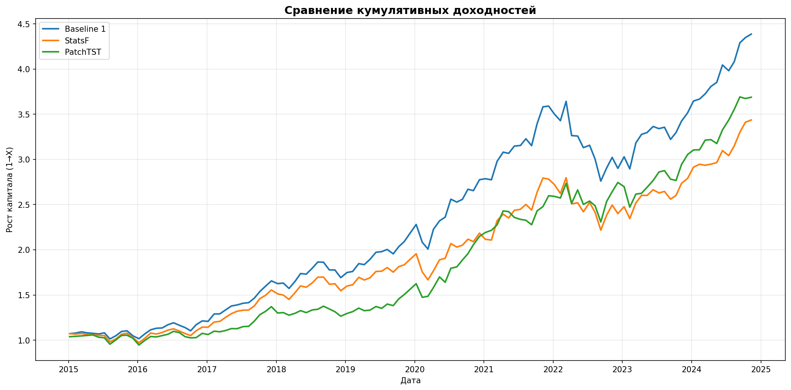

# PatchTST for Markowitz Portfolio Optimization

**Comparison of Return Forecasting Methods for Markowitz Portfolio Optimization: Historical Mean, AutoARIMA, PatchTST Transformer**

**Author:** Iurii Krotov
**Date:** January 2026

---

## Quick Start

```bash
# 1. Install dependencies
pip install -r requirements.txt

# 2. Run all models
python run_all.py
```

Results are saved to `results/`.

---

## Research Topic

Application of PatchTST Self-Supervised model for forecasting expected returns in Markowitz portfolio optimization.

## Objective

Empirically test the hypothesis that replacing historical means with PatchTST forecasts as expected return estimates improves Markowitz portfolio quality.

## Problem Statement

**Classical Markowitz problem** - Sharpe ratio maximization:

```
max  (w'μ - r_f) / sqrt(w'Σw)
s.t. Σw_i = 1, w_i >= 0
```

where:
- **w** — asset weight vector
- **μ** — expected return vector (this project compares estimation methods)
- **Σ** — return covariance matrix
- **r_f** — risk-free rate (from `config/config.yaml`)

## Approaches to μ Estimation

All three methods use identical backtest windows:
- Training window: `backtest.train_window` (default 1260 days, 5 years)
- Forecast horizon: `backtest.test_window` (default 21 days, 1 month)

| Approach | μ Estimation | Description |
|----------|--------------|-------------|
| **Baseline 1** | mean(r) × 252 | Classic Markowitz (historical mean) |
| **Baseline 2** | AutoARIMA.mean × 252 | StatsForecast AutoARIMA |
| **PatchTST** | forecast(21).mean × 252 | Self-Supervised Transformer |

## PatchTST Self-Supervised

**Source:** https://github.com/yuqinie98/PatchTST

- Implementation: `src/models/patchtst_reference/`
- `fast` / `full` modes configured in `config/config.yaml`
- Auto device selection: MPS (macOS) → CUDA → CPU

## Data

- **Assets:** 20 stocks from 10 S&P 500 sectors (configured in `config/config.yaml`)
- **Period:** 2010-01-01 — 2025-01-01
- **Source:** Yahoo Finance (Adjusted Close)
- **Files:** `data/raw/prices.csv`, `data/raw/log_returns.csv`

## Configuration

All project parameters are set in `config/config.yaml`:
- `data` — tickers and data period
- `backtest` — training and test windows
- `models` — PatchTST and AutoARIMA (StatsForecast) settings
- `optimization` — risk-free rate, covariance method, weight constraints
  - `covariance`: `sample` or `ledoit_wolf`
  - `gross_exposure` used only when `long_only=false`

## Project Structure

```
patchtst-portfolio-optimization/
├── run_all.py                    # Run all models
├── config/config.yaml            # Experiment configuration
├── data/raw/                     # Data (prices, log_returns)
├── src/
│   ├── data/                     # Loading and preprocessing
│   ├── models/
│   │   ├── patchtst.py           # PatchTST Self-Supervised
│   │   └── patchtst_reference/   # Reference implementation
│   ├── optimization/
│   │   ├── markowitz.py          # Markowitz optimizer
│   │   └── covariance.py         # Covariance estimation
│   ├── backtesting/
│   │   ├── backtest.py           # Baseline 1 (historical mean)
│   │   ├── backtest_statsforecast.py  # Baseline 2 (AutoARIMA)
│   │   └── backtest_patchtst.py  # PatchTST
│   └── utils/
│       └── forecast_metrics.py   # Forecast metrics
├── notebooks/
│   └── portfolio_comparison.py   # Standalone Python script
├── results/                      # Experiment results
├── LICENSE                       # MIT License
└── RESULTS.md                    # Research results
```

## Installation

```bash
python3 -m pip install -r requirements.txt
```

## Running

### Full run (interactive):

```bash
python3 run_all.py
```

The script will ask:
- whether to download data
- which models to run

### Background execution (for long tasks):

PatchTST can run for several hours. To keep the process running after closing the terminal:

```bash
# Run in background (nohup ignores terminal close signal)
nohup python3 run_all.py > output.log 2>&1 &

# Monitor progress in real-time
tail -f output.log

# Check if process is running
ps aux | grep run_all
```

### Individual backtests:

```bash
# Baseline 1: Historical mean
python3 src/backtesting/backtest.py

# Baseline 2: StatsForecast AutoARIMA
python3 src/backtesting/backtest_statsforecast.py

# PatchTST Self-Supervised
python3 src/backtesting/backtest_patchtst.py
```

## Results

**PatchTST — best for risk management** (lowest drawdown, highest Calmar):

| Metric | Baseline 1 | StatsForecast | PatchTST | Best |
|--------|------------|---------------|----------|------|
| Annual Return | **16.08%** | 13.26% | 14.07% | Baseline 1 |
| Sharpe Ratio | **0.93** | 0.71 | 0.80 | Baseline 1 |
| Calmar Ratio | 0.66 | 0.64 | **0.90** | PatchTST |
| Max Drawdown | -24.22% | -20.72% | **-15.61%** | PatchTST |



**Detailed analysis:** [RESULTS_EN.md](RESULTS_EN.md)

## License

MIT License. See [LICENSE](LICENSE) file.

### Acknowledgements

- [PatchTST](https://github.com/yuqinie98/PatchTST) — Transformer architecture for time series (Apache 2.0)
- [StatsForecast](https://github.com/Nixtla/statsforecast) — AutoARIMA implementation
